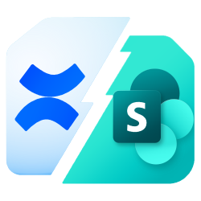
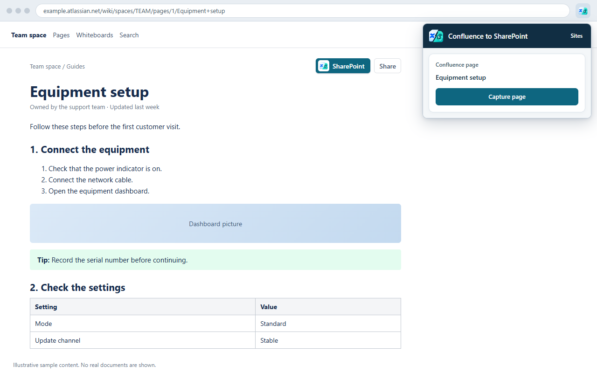
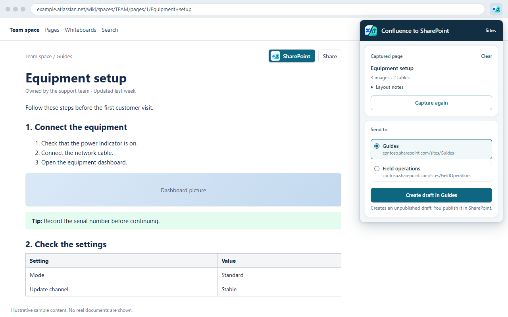
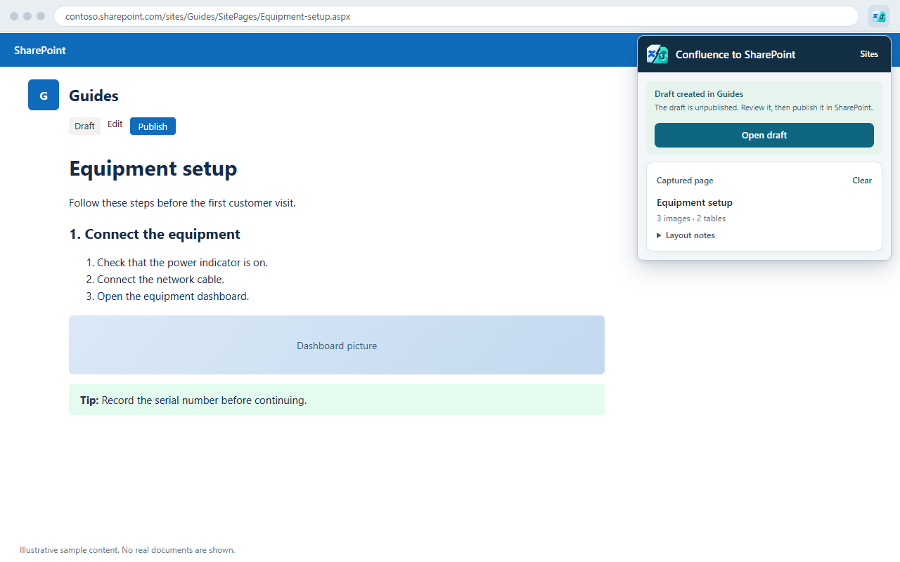

# Confluence to SharePoint



Copy a Confluence page into SharePoint without retyping it. Open the page in Chrome, capture it, and send it to one of your SharePoint sites. You get a new, **unpublished** SharePoint page with the text, tables, links and pictures, ready for you to review and publish.

- Uses the Confluence and SharePoint accounts you are already signed in to. There is no extra sign-in, app registration, server or API key.
- Never publishes anything and never changes an existing SharePoint page.
- Sends your content only to the SharePoint site you choose.

## Install

Install **Confluence to SharePoint** from its [Chrome Web Store page](https://chromewebstore.google.com/detail/ahgjchhmbdpohnbeoccnpnfaeillcedm). The listing is unlisted, so only people with the link can find it; share the link with anyone who needs it.

To keep it handy, pin it: select the puzzle-piece icon in Chrome's toolbar, then the pin next to **Confluence to SharePoint**.

## Copy a page

1. Open the Confluence page in Chrome. Select the teal **SharePoint** button, with the extension's logo, next to Share, or the extension's icon in the toolbar.
2. Select **Capture page**. The popup shows the page's title and what was captured.

   

3. Under **Send to**, choose the SharePoint site to copy into.
4. Select **Create draft in** and the site's name. The site opens in a background tab while the draft is created, then the draft comes to the front.

   

5. Review and edit the draft, then publish it in SharePoint when you are ready.

   

The screenshots show illustrative sample pages, not real documents.

You can close the popup while it works: the capture or the draft carries on, and opening the popup again shows how far it got.

## Your SharePoint sites

- The sites under **Send to** are the SharePoint sites you visit. Open a site in Chrome once and it appears there. Personal OneDrive and the SharePoint admin center are left out.
- Up to 30 sites are remembered, the most recently used first. Select **Sites** in the popup to pin a site to the top, remove one, or forget them all.
- Remembered sites are kept in this browser only and are never sent anywhere.
- If a site cannot take a draft, for example because its Site Pages library does not keep draft versions, the popup says why under the site's name.

## What gets copied

These come across as editable SharePoint content:

- Headings, paragraphs, lists, numbered steps and check lists
- Tables, with their column widths and cell colors
- Info, note, tip, warning and other panels, as colored callouts
- Code blocks, links, dates, mentions and emoji
- Pictures in their original quality, with their captions, at the size Confluence showed them
- Pictures a page shows from other websites, when those websites allow them to be copied
- Published pages, pages open in the editor, drafts and live docs

Some things change, and the popup lists each one under **Layout notes** so you know what to check before publishing:

- Live content, such as a Jira issue list, becomes a snapshot of its current rows or a link, or is left out.
- Pictures inside tables, panels or lists become links to the picture.
- A picture from another website that does not allow copying becomes a link to it.
- SVG pictures become PNG, and pictures wider than SharePoint can show are scaled down to fit.
- The table of contents is left out, because its links would not work in SharePoint.
- Fonts, colors and spacing follow SharePoint's page styles.

## Good to know

- **Live docs save as you type.** If your latest edits had not been saved when you captured, a note says so. Select **Capture again**.
- **Chrome asks for site access.** If your Chrome settings limit the extension to certain sites, the popup shows **Allow site access**, on a page it cannot read or when a send needs a site it may not reach. Allow it for your Confluence and SharePoint sites.
- **SharePoint asks you to sign in.** The popup says so. Select **Show the site’s tab**, sign in as usual, then select **Create draft** again. The extension never asks for your password.
- **A send that stops part-way is not retried automatically**, because a draft or pictures may already exist: the popup says **A draft may already exist**. Select **Review Site Pages** to check, then select **Clear** and capture again. A send that stops before anything was written can simply be sent again.
- **After an update** the extension refreshes its button on the Confluence pages you have open. If a button says **Reload this page**, reload it.
- **What you need:** Chrome 127 or later, a Confluence Cloud page (on `atlassian.net`) you can view, and a SharePoint Online site (on `sharepoint.com`) where you can create pages and upload files. Confluence Data Center or Server, and custom domains, are not supported yet.

## Privacy

Everything happens in your browser. A captured page stays in Chrome only until you close Chrome, and imported content goes only to the SharePoint site you choose. The addresses and names of the SharePoint sites you visit are remembered in this browser so you can send pages there; they are never sent anywhere. There is no server, analytics or tracking. When a page shows a picture from another website, the extension asks that website for the picture so it can copy it. See [PRIVACY.md](PRIVACY.md) for the full privacy policy and [CHANGELOG.md](CHANGELOG.md) for what changed in each version.

This is an independent tool and is not affiliated with Atlassian or Microsoft.

## Build from source

```powershell
npm ci
npm run build
```

The build is in `dist/sharepoint-helper/`. To try it, open `chrome://extensions`, turn on **Developer mode**, select **Load unpacked**, and choose that folder.


## License

[MIT](LICENSE)
