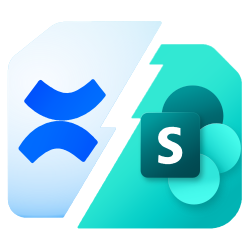
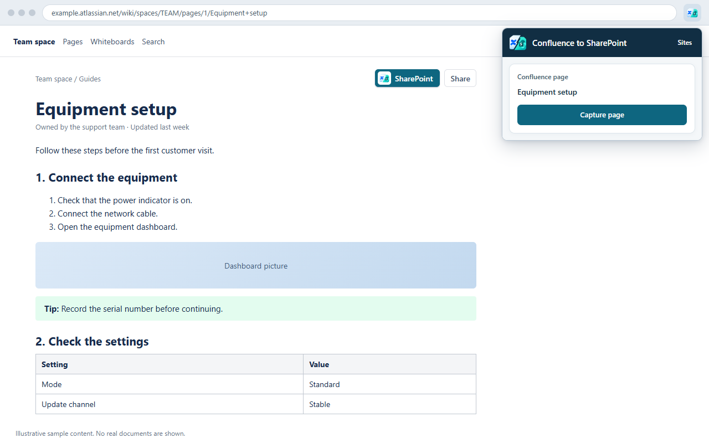
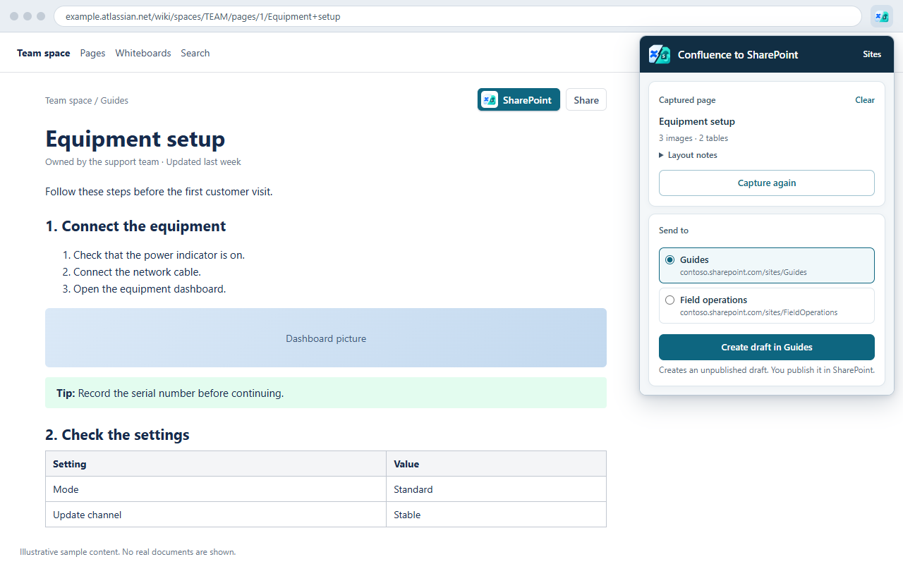
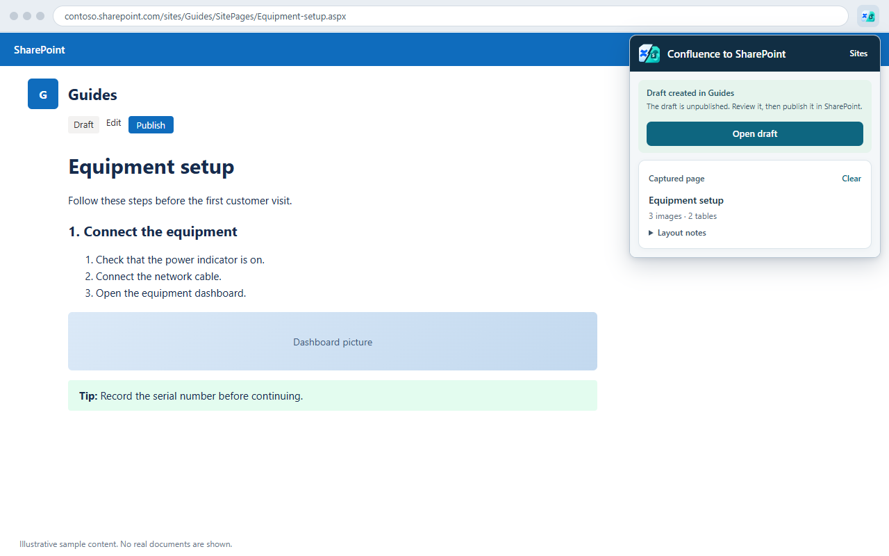

# Confluence to SharePoint



Copy a Confluence page into SharePoint without retyping it. Open the page in Chrome, capture it, and send it to one of your SharePoint sites: as a new page, or into a page you already have, to update it or to combine several Confluence pages into one. You get an **unpublished** SharePoint page with the text, tables, links and pictures, ready for you to review and publish. When the Confluence page changes, one click updates the SharePoint page you sent it to.

- Uses the Confluence and SharePoint accounts you are already signed in to. There is no extra sign-in, app registration, server or API key.
- Never publishes anything. A page you send into keeps showing its readers the published version until you publish the changes.
- Sends your content only to the SharePoint site you choose.

## Install

Install **Confluence to SharePoint** from its [Chrome Web Store page](https://chromewebstore.google.com/detail/ahgjchhmbdpohnbeoccnpnfaeillcedm). The listing is unlisted, so only people with the link can find it; share the link with anyone who needs it.

To keep it handy, pin it: select the puzzle-piece icon in Chrome's toolbar, then the pin next to **Confluence to SharePoint**.

## Copy a page

1. Open the Confluence page in Chrome. Select the teal **SharePoint** button, with the extension's logo, next to Share, or the extension's icon in the toolbar.
2. Select **Capture page**. The popup shows the page's title and what was captured.

   

3. Under **Send to**, choose the SharePoint site to copy into. It lists the sites you pinned and the SharePoint sites open in your tabs.
4. Select **Create draft in** and the site's name. The site opens in a background tab while the draft is created, then the draft comes to the front, with SharePoint's **Edit** and **Publish** (**Submit for approval** on a site whose pages are approved).

   

5. Review and edit the draft, then publish it in SharePoint when you are ready, or submit it for approval where the site's pages are approved.

   

The screenshots show illustrative sample pages, not real documents.

You can close the popup while it works: the capture or the draft carries on, and opening the popup again shows how far it got.

## Send into an existing page

Under **Send to**, the chosen site lists its pages open in your tabs: open the page you want to send into, or keep open the draft you just made. Choose one, and the popup asks **Send to “…”?**:

- **Add to bottom** keeps everything on the page and adds the Confluence page below it, starting with its title as a heading. To combine several Confluence pages into one SharePoint page, create a draft from the first, then add each of the others to it.
- **Overwrite** replaces the page's content, title, byline and date with the Confluence page's. The banner picture and the page's address stay. Use it to update a page after its Confluence page changed. If other Confluence pages were sent into it, the popup says Overwrite removes what they sent too.
- **Cancel** goes back to the site.

This browser remembers what it sent, so a Confluence page is not copied onto a site twice by accident. If the site already has it, **Send to** offers **Update “…”** in place of **Create draft**, and the page that has it offers **Update** in place of **Add to bottom**. You can still send it into another page of the same site, for example a combined page; the popup warns that this makes a second copy. Another browser, or one whose list was cleared, does not know what this one sent, unless you keep the list in your Confluence account (see [Your SharePoint sites](#your-sharepoint-sites)).

Either way the change is an unpublished draft of the page: readers keep the published version until you publish, and the earlier version stays in the page's version history. When the send finishes, the page comes to the front; a tab already showing it is reloaded rather than opening another.

A page open in SharePoint's editor holds it. If it is open in another tab, the send stops and **Show the tab** takes you there: close that tab, then send again. SharePoint takes about a minute to release a page after its editor closes, and the send waits for that. If someone else is editing the page or has it checked out, the popup names them.

## Update a page you sent

The extension remembers which Confluence page you sent to which SharePoint page. Open the popup on a Confluence page you sent before and, while no other page is captured, its card lists those pages under **Sent to**, each with **Update**.

Select **Update**. The extension captures the Confluence page as it is now and puts it into the SharePoint page in place of what it sent there before. As with every send, the change is an unpublished draft and the page comes to the front.

- On a page combined from several Confluence pages, only this page's part is replaced, where it is. The other parts stay, and so do sections and web parts added in SharePoint. Changes made in SharePoint to the part itself are replaced; the earlier version stays in the page's history.
- A page made from this Confluence page, with **Create draft** or **Overwrite**, also gets its title, byline and date again. A part added with **Add to bottom** gets its heading again.
- A page renamed, or moved to a folder of its Site Pages, is found by the permanent ID SharePoint gives it. Update writes the page at its new address, and the list follows it. A different page that now has the old address is never written.
- If the page was deleted or moved to another site, or what the Confluence page sent is no longer on it, nothing changes and the page leaves the list. Unless the Confluence page is also in another page of that site, the popup then offers **Create a new page**, which sends the capture to the same site as a new draft. A page sent with a version before 0.5.0 is known only by its address until its next successful Update, so a rename made before then cannot be followed: such a page still holds the earlier copy.
- **Overwrite** replaces everything on a page, so the other Confluence pages sent to it no longer list it.

The list is kept in this browser, and in your Confluence account if you turn that on (see [Your SharePoint sites](#your-sharepoint-sites)).

## Your SharePoint sites

- The SharePoint sites you visit are remembered and listed in the popup's **Sites** view: up to 30, pinned sites first, then the most recently used. Personal OneDrive and the SharePoint admin center are left out.
- **Send to** offers the sites you pin there, always, and any other remembered site while it's open in a tab. Pin the sites you send to often; select **Sites** to pin, unpin or remove a site, or forget them all. A site you choose stays in the list until the popup closes.
- Each site also remembers up to 10 of its pages you opened or sent to. Under **Send to** a site lists the ones open in a tab. The site's home page is never listed. Remove a page in the **Sites** view.
- Remembered sites and pages, and which Confluence pages you sent to them, are kept in this browser. **Forget all** clears them all, and removing a site or page also forgets what was sent to it.
- **Keep in my Confluence account**, at the foot of the **Sites** view, is off until you turn it on. It saves which Confluence pages you sent where as private settings of your own account on the Confluence sites you send pages from; Atlassian documents that only your account can read them. After Chrome is reset, or on another computer, turn it on and open the popup on a Confluence page: its **Sent to** list and **Update** come back. The sites and pages you only visited stay in the browser.
  - The setting and your pinned sites follow Chrome sync: turning the setting on or off, or pinning or unpinning a site, in one Chrome does the same in every Chrome signed in to your Google account with sync on. Without Chrome sync they stay in that browser.
  - Each computer keeps its own list too, and the account holds what all of them sent. Removing a site or page in the **Sites** view removes it on every computer where the setting is on.
  - Turning it off removes the copy from your account and leaves a small note there, so a computer without Chrome sync turns it off as well the next time it saves or reads there, and says so; turning it on again removes the note. Uninstalling the extension does not remove the copy: turn the setting off first.
  - **Forget all** clears this browser's lists, unpins your synced pins and turns the setting off.
- If a site cannot take a draft, for example because its Site Pages library does not keep draft versions, the popup says why under the site's name.

## What gets copied

These come across as editable SharePoint content:

- Headings, paragraphs, lists, numbered steps and check lists
- Tables, with their column widths and cell colors
- Info, note, tip, warning and other panels, as colored callouts
- Code blocks, links, dates, mentions and emoji
- Pictures in their original quality, with their captions, at the size Confluence showed them
- Pictures a page shows from other websites, when those websites allow them to be copied
- Published pages, pages open in the editor, drafts and live docs

Some things change, and the popup lists each one under **Layout notes** so you know what to check before publishing:

- Live content, such as a Jira issue list, becomes a snapshot of its current rows or a link, or is left out.
- A picture inside a list step comes over as a picture under its step, and the list's numbering goes on after it. Text that follows a picture inside the same step goes on after it without the list's indent.
- Pictures inside tables, panels and quotes stay in their cell, panel or quote, as SharePoint's own pictures inside text, with their captions.
- A picture from another website that does not allow copying becomes a link to it.
- SVG pictures become PNG, and pictures wider than SharePoint can show are scaled down to fit.
- The table of contents is left out, because its links would not work in SharePoint.
- Fonts, colors and spacing follow SharePoint's page styles.

## Good to know

- **Live docs save as you type.** If your latest edits had not been saved when you captured, a note says so. Select **Capture again**.
- **Chrome asks for site access.** If your Chrome settings limit the extension to certain sites, the popup shows **Allow site access**, on a page it cannot read or when a send needs a site it may not reach. Allow it for your Confluence and SharePoint sites.
- **SharePoint asks you to sign in.** The popup says so. Select **Show the site’s tab**, sign in as usual, then select **Create draft** again. The extension never asks for your password.
- **A send that stops part-way is not retried automatically**, because a draft or pictures may already exist: the popup says **A draft may already exist**, or **The page may have changed** for a page you sent into. Select **Review Site Pages**, **Review the draft** or **Review the page** to check, then select **Clear** and capture again. A send that stops before anything was written can simply be sent again.
- **After an update** the extension refreshes its button on the Confluence pages you have open. If a button says **Reload this page**, reload it.
- **What you need:** Chrome 127 or later, a Confluence Cloud page (on `atlassian.net`) you can view, and a SharePoint Online site (on `sharepoint.com`) where you can create pages and upload files. Confluence Data Center or Server, and custom domains, are not supported yet.

## Privacy

Everything happens in your browser. A captured page is kept only for the current Chrome session (**Clear** removes it, and Chrome discards it at its next start), and the content you send goes only to the SharePoint site you choose. The addresses and names of the SharePoint sites and pages you visit are remembered in this browser so you can send pages there, and so is which Confluence page you sent to which SharePoint page, so you can update it later. They are sent nowhere, except that **Keep in my Confluence account** keeps the sent list in your own Confluence account when you turn it on, and that the setting and your pinned sites are kept in Chrome's synced storage, which Chrome syncs through your Google account when Chrome sync is on. There is no server, analytics or tracking. When a page shows a picture from another website, the extension asks that website for the picture so it can copy it. See [PRIVACY.md](PRIVACY.md) for the full privacy policy and [CHANGELOG.md](CHANGELOG.md) for what changed in each version.

This is an independent tool and is not affiliated with Atlassian or Microsoft.

## Build from source

```powershell
npm ci
npm run build
```

The build is in `dist/sharepoint-helper/`. To try it, open `chrome://extensions`, turn on **Developer mode**, select **Load unpacked**, and choose that folder.


## License

[MIT](LICENSE)
